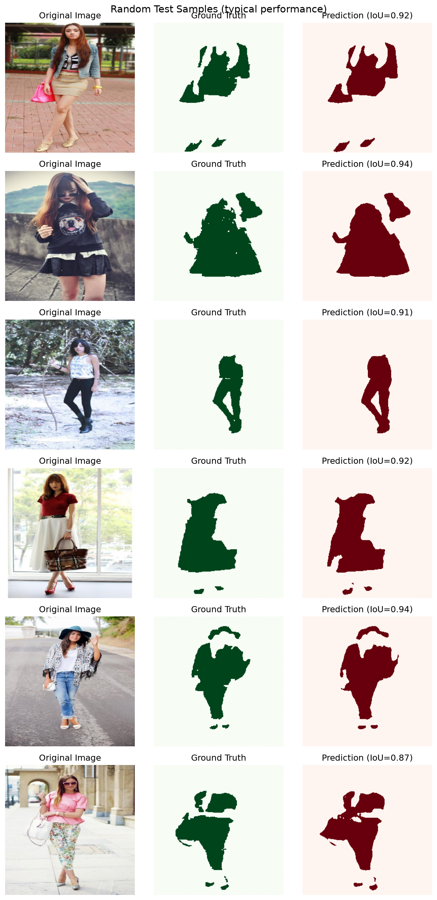
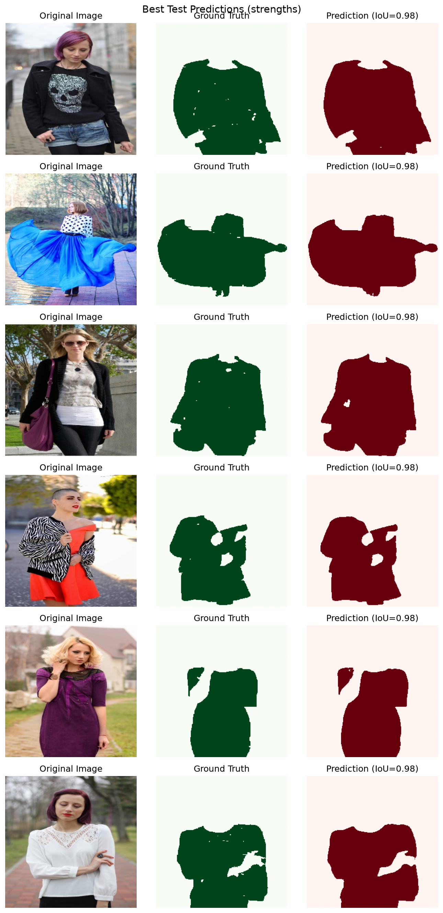
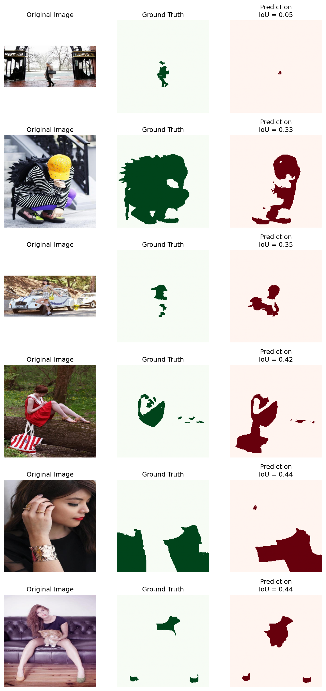
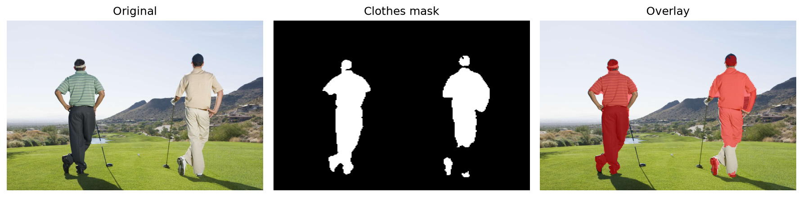
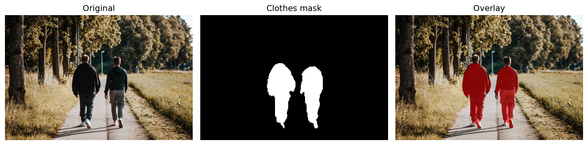

# Clothes Segmentation — Project Report

## 1. Introduction

The goal of this project was to build a computer vision model that can take an image of a person and identify which pixels belong to their clothes and which pixels belong to everything else.

I treated the problem as **binary semantic segmentation**:

* `1` → Clothes
* `0` → Not Clothes

I chose this setup because the main requirement of the project is to separate clothing from the person and the surrounding scene, rather than identifying each type of garment separately. This also keeps the problem focused on getting accurate clothing boundaries.

A possible application for this type of system is a virtual fitting room, but the current project focuses specifically on the clothes segmentation part.

---

## 2. Dataset Selection and Preprocessing

### 2.1 Dataset Selection

I used the **ATR Human Parsing Dataset**, using the version available on Hugging Face as `mattmdjaga/human_parsing_dataset`.

The dataset contains around **17,700 images** with pixel-level annotations for 18 semantic categories.

I considered other datasets, including iMaterialist, but ATR was a better fit for this particular task. The important thing for this project is not only detecting the person, but separating clothes from things such as hair, face, arms, and legs.

ATR provides separate labels for these regions. For example, it contains classes such as:

* Upper clothes
* Pants
* Skirt
* Dress
* Shoes
* Hair
* Face
* Arms
* Legs
* Background

This made it possible to convert the original human-parsing masks into a binary clothes/not-clothes mask without having to create new annotations.

Another practical advantage was that the dataset could be loaded directly using the Hugging Face `datasets` library, with the images and masks already aligned.

---

### 2.2 Converting the Labels to Binary Segmentation

The original ATR masks contain multiple classes, but I only needed two classes for this project.

I mapped the following classes to **Clothes (1)**:

* Hat
* Upper clothes
* Skirt
* Pants
* Dress
* Belt
* Left shoe
* Right shoe
* Bag
* Scarf

The following classes were mapped to **Not Clothes (0)**:

* Background
* Hair
* Sunglasses
* Face
* Left leg
* Right leg
* Left arm
* Right arm

The decision to include bags and scarves as clothes is a project-specific choice. Bags are technically accessories rather than garments, so a different application could choose to exclude them. In my implementation, they were included because they are worn or carried items that are visually associated with the clothing region.

---

### 2.3 Train, Validation, and Test Split

I split the dataset into:

* **70% training**
* **15% validation**
* **15% test**

A fixed random seed of `42` was used so that the split could be reproduced.

The final split sizes were:

| Split      | Images |
| ---------- | -----: |
| Train      | 12,394 |
| Validation |  2,656 |
| Test       |  2,656 |

The training set was used to learn the model parameters.

The validation set was used during development for monitoring performance, choosing the best checkpoint, and selecting the segmentation threshold.

The test set was kept separate and was only used for the final evaluation.

---

### 2.4 Preprocessing

All images were resized to **256 × 256** pixels.

I also normalized the images using the standard ImageNet mean and standard deviation:

```text
Mean = (0.485, 0.456, 0.406)
Std  = (0.229, 0.224, 0.225)
```

This was done because the ResNet34 encoder uses ImageNet-pretrained weights.

For data augmentation, I used:

* Horizontal flipping
* Random brightness and contrast changes

I kept the augmentation relatively simple because the main goal was to improve robustness without introducing unrealistic transformations.

Albumentations was used so that image transformations and their corresponding mask transformations remain aligned.

---

# 3. Model Architecture

I used a **U-Net architecture with a ResNet34 encoder pretrained on ImageNet**.

The main reason for choosing U-Net is that segmentation requires both semantic information and accurate spatial information.

The encoder learns high-level features that help the model understand what is present in the image, while the decoder gradually reconstructs the spatial resolution needed to produce a pixel-level mask.

### Encoder

The encoder is based on ResNet34.

I used the pretrained ResNet34 layers as the encoder and divided them into several stages with different spatial resolutions.

Using ImageNet-pretrained weights gives the model useful visual features before training starts instead of learning everything from scratch.

### Decoder

I implemented the decoder myself.

Each decoder block:

1. Upsamples the feature map.
2. Concatenates it with the corresponding encoder feature map.
3. Applies two `3 × 3` convolution layers.
4. Uses Batch Normalization and ReLU activation.

The encoder and decoder are connected using **skip connections**, which is one of the main ideas behind U-Net.

These connections allow the decoder to use both high-level semantic information and lower-level spatial details.

The final layer produces one output channel representing the probability that each pixel belongs to clothing.

---

### Why ResNet34?

I chose ResNet34 as a practical middle ground.

A smaller encoder such as ResNet18 would be lighter, while a larger backbone would require more computational resources. ResNet34 provides a reasonably strong feature extractor while still being practical to train on my available **8 GB GPU**.

The pretrained encoder also helped the model converge quickly. By the first epoch, the validation Dice score was already around `0.92`.

One limitation of the current architecture is that the final output is resized back to 256 × 256 using bilinear interpolation. There is no skip connection directly at the full 256 × 256 resolution. This can make very small details, such as thin straps or small parts of shoes, more difficult to recover.

---

# 4. Loss Function

I used a combination of **Binary Cross Entropy and Dice Loss**:

```text
Loss = 0.5 × BCE + 0.5 × Dice Loss
```

I chose this combination because the task is pixel-level binary classification and the clothing region usually occupies only part of the image.

### BCE Loss

Binary Cross Entropy focuses on the classification of individual pixels.

It helps the model learn whether each pixel should belong to the clothing class or the non-clothing class.

### Dice Loss

Dice Loss focuses more directly on the overlap between the predicted mask and the ground-truth mask.

This is useful for segmentation because having a good overlap between the two regions is more important than simply getting a large number of background pixels correct.

Using both losses gives the model pixel-level supervision from BCE while also directly encouraging better mask overlap through Dice Loss.

---

# 5. Training

The model was trained for **20 epochs**.

The main training settings were:

| Setting       | Value              |
| ------------- | ------------------ |
| Optimizer     | AdamW              |
| Learning Rate | `1e-4`             |
| Weight Decay  | `1e-4`             |
| Batch Size    | 8                  |
| Epochs        | 20                 |
| Loss          | 0.5 BCE + 0.5 Dice |
| Image Size    | 256 × 256          |
| Device        | CUDA GPU           |

I also used `ReduceLROnPlateau` to reduce the learning rate when validation performance stopped improving.

The learning rate was reduced three times during training as validation performance plateaued.

At the end of training:

| Metric |  Train | Validation |
| ------ | -----: | ---------: |
| Dice   | 0.9634 |     0.9478 |
| IoU    | 0.9294 |     0.9008 |

The difference between training and validation performance remained relatively small, which suggests that there was no severe overfitting during the 20 epochs.

The best checkpoint was saved as:

```text
outputs/checkpoints/best_model.pth
```

---

# 6. Evaluation

## 6.1 Evaluation Metrics

I used four main metrics:

### IoU

Intersection over Union measures the overlap between the predicted mask and the ground-truth mask.

```text
IoU = Intersection / Union
```

A higher IoU means that the predicted clothing region overlaps better with the actual clothing region.

### Dice

Dice also measures the overlap between prediction and ground truth and is commonly used for segmentation tasks.

### Precision

Precision measures how many pixels predicted as clothing were actually clothing.

High precision means fewer false-positive clothing pixels.

### Recall

Recall measures how much of the actual clothing region was successfully detected.

High recall means fewer clothing pixels were missed.

Using all four metrics gives a more complete picture than relying on one metric alone.

---

## 6.2 Threshold Optimization

The model produces a probability for every pixel.

I did not assume that `0.5` was automatically the best threshold for converting these probabilities into a binary mask.

Instead, I tested thresholds from:

```text
0.30 → 0.70
```

with a step of `0.05`.

The best validation IoU was obtained with:

```text
Threshold = 0.45
```

The validation results around the best point were:

| Threshold | Validation IoU |
| --------: | -------------: |
|      0.30 |         0.8964 |
|      0.35 |         0.8972 |
|      0.40 |         0.8976 |
|  **0.45** |     **0.8977** |
|      0.50 |         0.8976 |
|      0.55 |         0.8972 |
|      0.60 |         0.8966 |
|      0.65 |         0.8956 |
|      0.70 |         0.8942 |

The curve is relatively flat around the best threshold, meaning that the model's segmentation performance is not highly sensitive to the exact threshold in this range.

The threshold of `0.45` was then fixed before evaluating the test set.

---

# 7. Final Test Results

After selecting the model and threshold using the validation set, I evaluated the model on the held-out test set containing **2,656 images**.

The final results were:

| Metric        | Test Result |
| ------------- | ----------: |
| **IoU**       |  **0.8974** |
| **Dice**      |  **0.9443** |
| **Precision** |  **0.9419** |
| **Recall**    |  **0.9497** |

The results show that the model is able to produce a strong binary clothing segmentation on the held-out test set.

The relatively close precision and recall values also indicate that the model is not heavily biased toward either producing too many clothing pixels or missing large portions of the clothing regions.

---

# 8. Qualitative Test-Set Evaluation

In addition to the numerical metrics, I visualized predictions from the test set.

The visualization compares:

```text
Original Image
Ground Truth
Prediction
```

I generated both randomly selected test examples and the highest-IoU examples.

The random examples give a more general view of how the model behaves, while the best examples show cases where the model produces particularly accurate masks.

**Random test samples (typical performance):**



**Best test predictions (strengths):**



These visualizations are useful because numerical metrics alone do not show exactly where the segmentation boundaries are correct or where the model makes mistakes.

---

# 9. Error Analysis

To understand the model's limitations, I also examined the six test images with the lowest per-image IoU scores.



### 9.1 Small and Distant Subject — IoU = 0.05

The worst example contains a person who occupies only a small portion of the image, with a complex outdoor background.

The model detected only a few small clothing regions and missed most of the person.

This suggests that small and distant subjects are challenging, especially after resizing the image to 256 × 256.

---

### 9.2 Unusual Pose and Large Nearby Object — IoU = 0.33

In this example, the person has a non-standard pose and there is a large dark object close to the body.

The model captured part of the general clothing shape but did not reproduce the ground-truth boundaries accurately.

This shows that unusual poses and objects close to the body can make the segmentation problem harder.

---

### 9.3 Partial Occlusion — IoU = 0.35

Part of the person is blocked by a car.

The visible clothing is therefore fragmented, and the model has difficulty recovering all of the separate regions.

This is an example of the limitations of the model under partial occlusion.

---

### 9.4 Clothing and Nearby Object Confusion — IoU = 0.42

The model correctly detected a large part of a red dress, but it extended the predicted mask into a nearby object on the ground.

This is a false-positive segmentation caused by a nearby object being visually and spatially close to the clothing.

---

### 9.5 Hair Occlusion and Disconnected Regions — IoU = 0.44

In this close-up example, hair covers part of the clothing.

The ground-truth clothing is also divided into separate regions. The model detects one region but misses another.

This shows that occlusion and small disconnected clothing regions remain challenging.

---

### 9.6 Small Clothing Components — IoU = 0.44

In the final case, the main clothing region is segmented reasonably well, but smaller regions such as shoes are missed.

This suggests that the model handles large continuous clothing regions better than small isolated regions.

---

# 10. Strengths

Based on the quantitative evaluation and visual inspection, the model has several strengths.

### Strong segmentation of large clothing regions

The model generally performs well when the clothing occupies a reasonable portion of the image and forms a relatively continuous region.

### Good balance between precision and recall

The final precision and recall were:

```text
Precision = 0.9419
Recall    = 0.9497
```

This means the model is not strongly biased toward either over-segmenting or under-segmenting clothing.

### Reasonable performance on common poses

The model generally performs better when the person is clearly visible and has a common standing or seated pose.

### Works with multiple people at the semantic level

Since the model performs semantic segmentation, it can identify clothing regions belonging to multiple people in the same image.

However, it does not produce separate instance masks for each person.

---

# 11. Weaknesses and Limitations

The error analysis revealed several recurring limitations.

### 11.1 Small or Distant Subjects

When the person occupies only a small part of the image, important clothing details can disappear during resizing.

This was especially clear in the worst test example, which had an IoU of only `0.05`.

### 11.2 Small Clothing Regions

Small regions such as shoes can be missed even when the main clothing region is segmented correctly.

### 11.3 Occlusion

The model becomes less accurate when clothing is partially hidden by cars, objects, hair, or other people.

### 11.4 Unusual Poses

Crouched, bent, or unusual body poses can make it harder for the model to determine the correct clothing boundaries.

### 11.5 Nearby Accessories and Objects

Bags and other objects close to the body can sometimes become part of the predicted clothing mask.

This is also related to the decision to include bags in the clothing class during preprocessing.

### 11.6 Similar Clothing and Background Colors

When clothing has a similar appearance to the surrounding background, the model may have difficulty separating the two.

---

# 12. External Image Test

I also tested the trained model on images outside the ATR dataset using the inference pipeline.

**Example 1 — clean segmentation:**

![[Fitting Room] - external test](outputs/inference/images2_comparison.png)

This image contained one person standing on Fitting Room, and the model produced relatively clean clothing regions for him.

**Example 2 — clean segmentation:**



This image contained two people standing outdoors, and the model produced relatively clean clothing regions for both people.

**Example 3 — missed pants:**



This image contained two people walking away from the camera. The model detected their jackets reasonably well but missed much of their pants.

The second example contained two challenging conditions: the people were relatively small in the image, and the pants had a similar gray tone to the path around them.

These observations are consistent with some of the failure patterns seen in the test-set error analysis. However, this was only a small qualitative external test, so a larger external dataset would be needed to make stronger claims about real-world generalization.

---

# 13. Overall Limitations

The current system should not be considered a complete clothing understanding system.

It produces a **binary semantic segmentation mask**, meaning that it answers:

> "Which pixels belong to clothing?"

It does not answer:

> "Which pixels belong to this specific person's shirt?"

or:

> "Which pixels are pants, shoes, shirts, or dresses?"

It also does not perform instance segmentation.

Therefore, in an image containing several overlapping people, the clothing pixels are represented as one binary mask rather than being separated into individual people.

The model is also more likely to struggle with:

* Very small or distant people
* Heavy occlusion
* Low-contrast clothing
* Unusual poses
* Small disconnected clothing regions
* Objects touching or overlapping the clothing

These are important areas for future improvement.

---

# 14. Possible Future Improvements

Several improvements could be explored in a future version of the project.

### Higher resolution

Using a larger input resolution could help preserve small details such as shoes, straps, and thin clothing boundaries.

### Stronger augmentation

Additional augmentations such as scale changes, controlled rotations, and random crops could improve robustness to different poses and image conditions.

### Better decoder

Adding higher-resolution skip connections could help recover fine segmentation boundaries.

### Instance-aware segmentation

If the system needs to work with multiple people separately, an instance segmentation or person-aware approach would be more appropriate than the current binary semantic segmentation setup.

### More diverse training data

Adding images with more unusual poses, occlusion, outdoor environments, and small/distant people could improve performance in the cases identified during error analysis.

### Different label definitions

For applications focused specifically on garments, bags and other accessories could be assigned separate classes instead of grouping them together with clothes.

---

# 15. Conclusion

The project successfully implemented an end-to-end binary clothes segmentation pipeline, starting from dataset preprocessing and label conversion, through model training and evaluation, and finally inference on new images.

The final U-Net with a ResNet34 encoder achieved:

* **IoU: 0.8974**
* **Dice: 0.9443**
* **Precision: 0.9419**
* **Recall: 0.9497**

on the held-out test set.

The results show that the model can segment large and clearly visible clothing regions effectively. At the same time, the error analysis showed that small subjects, occlusion, unusual poses, disconnected clothing regions, and low contrast between clothing and the background remain challenging.

Overall, the project provides a working clothes segmentation system with a complete training, evaluation, visualization, and inference pipeline, while also clearly identifying the conditions where the current approach needs further improvement.
